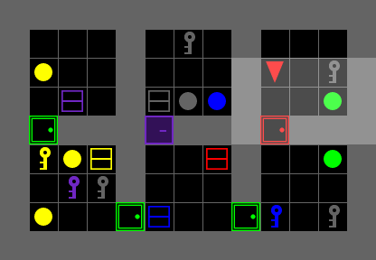

# Mini AI for MiniGrid Baby AI Environment

<p align = "center">
  
</p>

<p align = "center">
  Computer Science Department
  <br>
  A project for
  <br>
  the Artificial Intelligence Fundamentals course
  <br>
  in the AI Master's program at the University of Pisa.
</p>

## Authors
* **Filippo Baglini**        - [FilippoBaglini](https://github.com/filippo-baglini)
* **Federico Bonaccorsi**         - [FedericoBonaccorsi](https://github.com/Syreel)
* **Gabriele Benedetti**        - [GabrieleBenedetti](https://github.com/gbenedetti22)
* **Nico Conti** - [NicoConti](https://github.com/Nico-Conti)

## 🎯 Project Objective
The goal of this project is to design a personal AI capable of interacting with the MiniGrid environment, a sandbox specifically designed to develop and evaluate agents in grid-world tasks with minimal complexity. Our utility-based model agent, implementing fundamental AI algorithms, is tailored to solve all BabyAI environments efficiently.

## 🛠 Features
### Custom AI Agent:
Purpose-built for BabyAI environments with a focus on efficiency of steps.
Utilizes the A* search and Online Planning as the main algorithm for decision-making.
### Adaptability:
While designed for BabyAI, the AI can be extended for more complex MiniGrid environments with modifications to the mission parsing method.
### Performance:
Achieves a 99.8% win rate across 9,200 levels, surpassing the default BabyAI bot from the Farama Foundation library, which has a win rate of 99.47%. Additionally, our approach completes levels using fewer steps, demonstrating superior efficiency.

## 🚀 Getting Started
### Prerequisites

Installation
Clone the Repository:

```bash
git clone https://github.com/filippo-baglini/aif-project.git
cd aif-project
```

Install Dependencies:

```bash
pip install -r requirements.txt
```

Run the AI:
```bash
python3 tests/OurBot_test
```

## 🎥 Simulation

This GIF showcases our bot solving a challenging level where it must navigate a path filled with obstacles to drop an item beside another specific object.

<div align="center">
  
</div>


## 🧠 About Minigrid
Click to find more info about [MiniGrid](https://github.com/Farama-Foundation/Minigrid?tab=readme-ov-file)

```bibtex
@inproceedings{MinigridMiniworld23,
  author       = {Maxime Chevalier{-}Boisvert and Bolun Dai and Mark Towers and Rodrigo Perez{-}Vicente and Lucas Willems and Salem Lahlou and Suman Pal and Pablo Samuel Castro and Jordan Terry},
  title        = {Minigrid {\&} Miniworld: Modular {\&} Customizable Reinforcement Learning Environments for Goal-Oriented Tasks},
  booktitle    = {Advances in Neural Information Processing Systems 36, New Orleans, LA, USA},
  month        = {December},
  year         = {2023},
}
```

```bibtex
@article{chevalier2018babyai,
  title={Babyai: A platform to study the sample efficiency of grounded language learning},
  author={Chevalier-Boisvert, Maxime and Bahdanau, Dzmitry and Lahlou, Salem and Willems, Lucas and Saharia, Chitwan and Nguyen, Thien Huu and Bengio, Yoshua},
  journal={arXiv preprint arXiv:1810.08272},
  year={2018}
}
```

